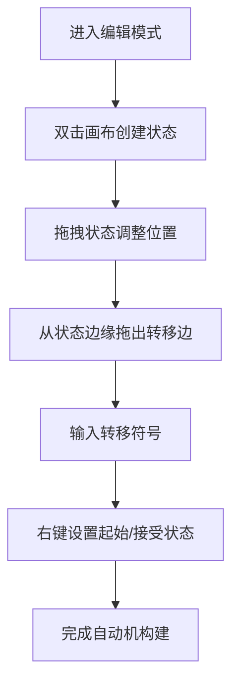
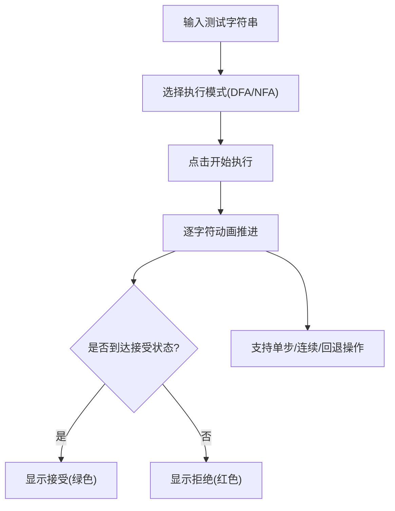
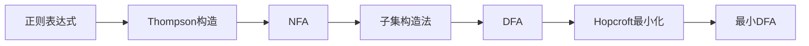

## 1. 产品概述

有限自动机与形式语言交互式教学工具是一款面向计算理论课程学生的可视化学习平台。通过直观的画布交互和动态演示，帮助学生理解有限自动机（DFA/NFA）、正则表达式、形式语言等核心概念，降低理论学习门槛。

- **核心价值**：将抽象的计算理论概念转化为可视化、可交互的学习体验
- **目标用户**：计算机专业本科生、计算理论课程学习者
- **市场定位**：教育类工具软件，辅助课堂教学与自主学习

## 2. 核心功能

### 2.1 功能模块总览

| 模块 | 核心功能 |
|------|---------|
| 自动机编辑器 | 画布拖拽、状态创建、转移边绘制、属性编辑 |
| 字符串测试 | 逐字符动画执行、DFA/NFA模式切换、执行树展示 |
| 子集构造法 | NFA转DFA分步动画、epsilon闭包计算、状态转换表 |
| DFA最小化 | Hopcroft算法演示、等价类划分、最小DFA生成 |
| 正则表达式转换 | Thompson构造法、正则解析器、完整转换链路 |
| 语言运算 | 并集、连接、闭包运算动画、自动机保存管理 |
| 教学引导 | 渐进式关卡、自动评测、正反例测试 |
| 导入导出 | JSON格式、LaTeX TikZ代码导出 |

### 2.2 页面详情

| 页面/面板 | 模块名称 | 功能描述 |
|----------|---------|---------|
| 主页面 | 顶部工具栏 | 模式切换（编辑/测试/转换）、字母表设置、速度控制、导入导出按钮 |
| 主页面 | 画布区域 | Canvas绘制自动机、支持缩放平移、节点拖拽、边绘制 |
| 主页面 | 右侧面板 | 状态转换表、执行树、关卡信息、操作日志 |
| 主页面 | 底部控制栏 | 字符串输入框、播放控制（播放/暂停/单步/回退）、结果显示 |
| 关卡选择 | 关卡列表 | 8+关卡卡片、进度标记、自由跳转 |
| 保存管理 | 自动机列表 | 最多5个保存槽、命名保存、加载删除 |

## 3. 核心流程

### 3.1 自动机构建流程

### 3.2 字符串测试流程

### 3.3 完整转换链路

## 4. 用户界面设计

### 4.1 设计风格

- **设计理念**：学术科技风，简洁专业，深色主题为主
- **主色调**：深蓝灰色背景 (#0f172a)，突出学术感
- **强调色**：青色 (#06b6d4) 用于活跃状态，绿色 (#10b981) 用于接受/成功，红色 (#ef4444) 用于拒绝/错误
- **节点样式**：圆形节点，起始状态绿色双圈，接受状态红色双圈，活跃状态青色高亮
- **字体**：JetBrains Mono 等宽字体用于代码和符号，Inter 用于界面文字
- **布局风格**：三栏布局（左侧工具栏 + 中央画布 + 右侧信息面板）

### 4.2 页面设计概览

| 页面 | 模块 | UI元素 |
|-----|------|--------|
| 主页面 | 顶部工具栏 | 模式切换标签、工具按钮组、字母表输入框、速度选择器 |
| 主页面 | 画布区域 | 无限画布、网格背景、状态节点、转移边箭头、自环弧 |
| 主页面 | 右侧面板 | 可折叠面板组：状态转换表、执行树、操作历史 |
| 主页面 | 底部控制栏 | 字符串输入框、播放控制按钮组、进度条、结果指示器 |
| 关卡页面 | 关卡网格 | 关卡卡片（编号、标题、状态图标、描述摘要） |
| 保存管理 | 保存列表 | 保存槽卡片（名称、创建时间、预览缩略图、操作按钮） |

### 4.3 交互动效

- 状态节点悬停：轻微放大 + 阴影加深
- 转移边闪烁：执行时脉冲动画，2次/秒
- 状态转换：平滑过渡动画（300ms）
- 画布缩放：惯性滚动 + 平滑缩放
- 面板展开/收起：高度过渡动画

### 4.4 响应式设计

- 桌面端：完整三栏布局（≥1280px）
- 平板端：左右面板可收起（768px-1279px）
- 移动端：单列布局，面板切换使用标签页（<768px）

## 5. 教学关卡设计

### 关卡列表（至少8关）

| 关卡 | 标题 | 核心知识点 | 评测方式 |
|-----|------|-----------|---------|
| 1 | 认识字母表和状态 | 字母表、状态、转移边基本概念 | 选择题 + 简单构造 |
| 2 | 构建你的第一个DFA | DFA定义、接受/拒绝 | 构造自动机，10正10反测试 |
| 3 | 认识NFA和空串转移 | NFA不确定性、epsilon转移 | 理解题 + 构造题 |
| 4 | 正则表达式基础 | 连接、并、Kleene星号 | 正则→自动机匹配题 |
| 5 | 子集构造法 | NFA→DFA转换、epsilon闭包 | 步骤排序 + 结果验证 |
| 6 | DFA最小化 | Hopcroft算法、等价类 | 最小化结果对比 |
| 7 | 语言运算 | 并集、连接、闭包 | 运算结果构造 |
| 8 | 泵引理反证 | 泵引理、非正则语言证明 | 交互式演示 + 问答 |

## 6. 数据模型概览

- **状态（State）**：id、标签名、位置(x,y)、是否起始、是否接受
- **转移边（Transition）**：id、起始状态id、目标状态id、符号集合
- **自动机（Automaton）**：状态集合、转移集合、字母表、类型(DFA/NFA)
- **执行步骤（ExecutionStep）**：步骤索引、当前活跃状态集、已消耗字符、转移记录
- **关卡（Level）**：关卡id、标题、描述、目标语言、测试用例集
