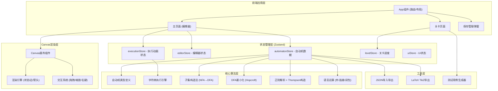

## 1. 架构设计



## 2. 技术描述

- **前端框架**：React 18 + TypeScript
- **构建工具**：Vite
- **样式方案**：Tailwind CSS 3
- **状态管理**：Zustand
- **图标库**：Lucide React
- **画布渲染**：HTML5 Canvas API (自研，不依赖第三方图形库)
- **后端**：无（纯前端单页应用）
- **数据存储**：LocalStorage (保存自动机和关卡进度)

## 3. 目录结构

```
src/
├── components/          # 组件
│   ├── canvas/         # Canvas相关组件
│   │   ├── AutomatonCanvas.tsx
│   │   ├── Renderer.ts
│   │   └── InteractionSystem.ts
│   ├── toolbar/        # 工具栏
│   │   ├── TopToolbar.tsx
│   │   └── ControlBar.tsx
│   ├── panels/         # 右侧面板
│   │   ├── TransitionTable.tsx
│   │   ├── ExecutionTree.tsx
│   │   └── InfoPanel.tsx
│   ├── dialogs/        # 弹窗
│   │   ├── SymbolInput.tsx
│   │   ├── ImportExport.tsx
│   │   └── SaveManager.tsx
│   └── common/         # 通用组件
├── stores/             # Zustand stores
│   ├── automatonStore.ts
│   ├── editorStore.ts
│   ├── executionStore.ts
│   ├── levelStore.ts
│   └── uiStore.ts
├── engine/             # 核心算法引擎
│   ├── types.ts        # 类型定义
│   ├── execution.ts    # 字符串执行
│   ├── subsetConstruction.ts
│   ├── minimization.ts
│   ├── regexp.ts       # 正则解析+Thompson
│   ├── operations.ts   # 语言运算
│   └── utils.ts
├── levels/             # 关卡数据
│   ├── index.ts
│   └── levelData.ts
├── utils/              # 工具函数
│   ├── jsonIO.ts
│   ├── tikzExport.ts
│   ├── testGenerator.ts
│   └── layout.ts       # 自动布局
├── hooks/              # 自定义hooks
│   ├── useCanvas.ts
│   └── useAnimation.ts
├── pages/              # 页面
│   ├── EditorPage.tsx
│   └── LevelsPage.tsx
├── App.tsx
├── main.tsx
└── index.css
```

## 4. 核心数据模型

### 4.1 类型定义

```typescript
// 状态节点
interface State {
  id: string;
  label: string;
  x: number;
  y: number;
  isStart: boolean;
  isAccept: boolean;
}

// 转移边
interface Transition {
  id: string;
  from: string;
  to: string;
  symbols: string[];  // 符号集合，epsilon用'ε'表示
}

// 自动机
interface Automaton {
  states: State[];
  transitions: Transition[];
  alphabet: string[];
  type: 'DFA' | 'NFA';
}

// 执行步骤
interface ExecutionStep {
  stepIndex: number;
  activeStates: string[];
  consumedChar: string | null;
  transitionIds: string[];
  isDead: boolean;
}

// 关卡
interface Level {
  id: number;
  title: string;
  description: string;
  type: 'construct' | 'quiz' | 'demo';
  targetLanguage?: string;
  testCases?: { input: string; accept: boolean }[];
  hints: string[];
}
```

## 5. 路由定义

| 路由 | 页面 | 功能 |
|------|------|------|
| / | 编辑器页面 | 自动机编辑、测试、转换主界面 |
| /levels | 关卡页面 | 教学关卡列表与关卡详情 |

## 6. 核心模块设计

### 6.1 Canvas渲染引擎

- 采用即时模式渲染（Immediate Mode Rendering）
- 使用 requestAnimationFrame 驱动动画循环
- 维护视图变换矩阵（平移+缩放）
- 支持的绘制元素：状态节点（圆形/双圈）、转移边（直线/弧线+箭头）、标签文字

### 6.2 交互系统

- 自定义事件系统，处理鼠标事件
- 碰撞检测：点-圆（状态）、点-曲线（边）
- 拖拽状态机：空闲/拖拽状态/拖拽画布/绘制转移边
- 右键菜单：状态菜单、边菜单、空白菜单

### 6.3 执行动画引擎

- 状态机模式：idle / running / paused / finished
- 时间控制：基于 requestAnimationFrame + 速度倍率
- 步骤回退：完整步骤历史栈，支持任意步回退
- DFA模式：单活跃状态，边闪烁动画
- NFA模式：多活跃状态（透明度渐变），执行树面板同步更新

### 6.4 子集构造法

- 分步计算：每一步产生一个新的DFA状态
- 步骤数据：当前子集、epsilon闭包计算过程、各符号的后继
- 动画控制：可暂停、回退、跳到结尾
- 自动布局：生成的DFA状态在画布右侧区域自动排列

### 6.5 正则表达式解析

- 运算符优先级：*（星号）> 连接 > |（并）
- 支持括号嵌套
- Thompson构造法逐步骤动画
- 步骤类型：基本字符、并、连接、星号

## 7. 性能考量

- Canvas元素使用离屏渲染缓存静态元素
- 状态和转移边数量预期在50以内，无需复杂优化
- 动画使用 requestAnimationFrame，避免频繁重渲染
- Zustand 状态细粒度订阅，减少不必要的组件重渲染
